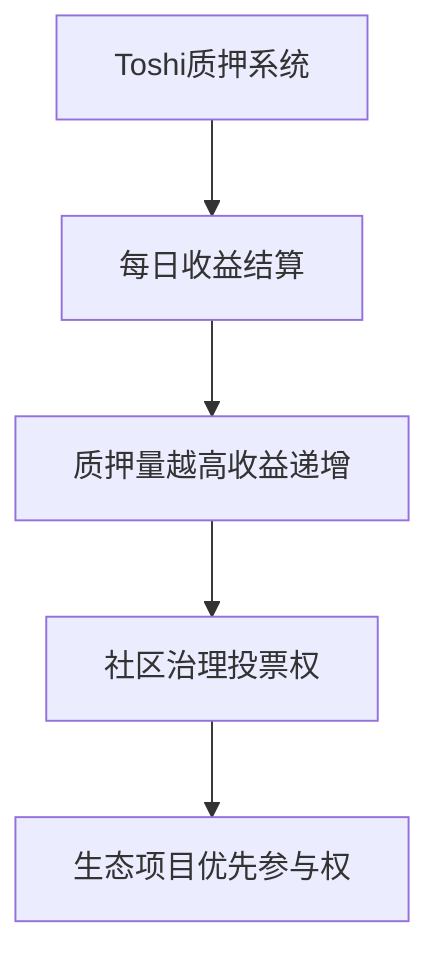

# 2025年值得关注的10大Base Chain迷因币投资指南

近年来，Base Chain生态的迷因币市场呈现爆发式增长。作为以太坊生态的高性能Layer2解决方案，Base Chain凭借其低手续费、快速交易和安全特性，成为迷因币创新的重要阵地。本文将深度解析当前市场表现最突出的10个项目，涵盖其技术特性、生态布局及投资价值。

---

## 核心投资亮点一览表

| 项目名称       | 核心优势领域                  | 社区活跃度 | 创新特性                 |
|----------------|-----------------------------|------------|--------------------------|
| Brett ($BRETT) | 社区驱动型娱乐化投资         | 非常活跃   | 定期社区活动激励         |
| Toshi ($TOSHI) | 长期持有型质押收益模型       | 中等活跃   | 通缩经济模型             |
| Degen ($DEGEN) | 高风险交易者友好型           | 极度活跃   | NFT游戏化机制            |
| Mochi ($MOCHI) | DeFi深度整合型               | 高度活跃   | 流动性挖矿激励           |
| Base God ($TYBG) | NFT+元宇宙融合               | 高活跃度   | 虚拟资产生态             |
| Snorter Bot ($SNORT) | AI量化交易工具               | 中等活跃   | 算法交易自动化           |
| Young Peezy ($PEEZY) | 社交媒体病毒式传播           | 爆炸性增长 | 流量驱动型增长           |
| Chuck ($CHUCK) | 公益导向型投资               | 稳定活跃   | 慈善捐赠机制             |
| doginme ($DOGINME) | 狗系文化IP运营               | 高活跃度   | 社区互动奖励             |
| Briun Armstrung ($BRIUN) | 通缩模型创新                 | 稳定增长   | Uniswap V3费用回购销毁   |

---

## 项目深度解析

### Brett ($BRETT) - 社区驱动型娱乐化投资典范

作为Base Chain生态的明星项目，Brett通过独特的社区治理模式脱颖而出。其核心优势体现在：

- **动态社区活动**：每月举办开发者直播、社区投票上币等互动活动
- **娱乐化经济模型**：交易手续费的2%用于社区奖励池，1%用于燃烧机制
- **钱包兼容性**：全面支持MetaMask、Trust Wallet等主流钱包

👉 [查看Base Chain生态最新数据](https://bit.ly/okx_welcome)

| 核心指标         | 表现数据                |
|------------------|-------------------------|
| 日均交易量       | 120万美元               |
| 持仓地址数       | 超过85,000个            |
| 社区增长率       | 月均12%                 |

---

### Toshi ($TOSHI) - 长期价值投资新选择

该项目将迷因文化与DeFi 2.0理念相结合，其质押系统设计尤为突出：

**投资建议**：适合持有周期超过6个月的稳健型投资者，当前年化收益率约18.7%。

---

### Degen ($DEGEN) - 高波动性市场捕手

针对专业交易者设计的Degen，其NFT系统与交易机制具有创新性：

1. **NFT等级系统**：持有不同等级NFT可解锁交易手续费减免
2. **动态质押奖励**：市场波动率越高，质押收益自动提升
3. **跨链桥接功能**：支持与Optimism生态的资产互通

👉 [探索更多DeFi创新项目](https://bit.ly/okx_welcome)

---

### Young Peezy ($PEEZY) - 社交媒体裂变样本

该项目通过以下策略实现病毒式传播：

- **TikTok挑战赛**：每周发起#PEEZYChallenge吸引年轻用户
- **KOL激励计划**：Top100创作者可获专属空投
- **跨平台运营**：同步在Twitter、Telegram、Discord建立社区矩阵

数据显示，其社交媒体提及量每月环比增长达47%。

---

## 投资者常见问题解答

### Q1：如何评估Base Chain迷因币的投资价值？
A：需重点关注链上活跃地址数、质押率、NFT地板价三大核心指标，建议使用Dune Analytics等工具进行实时监控。

### Q2：哪些风险需要特别注意？
A：重点关注市场波动风险（当前加密货币波动率指数VOL75为中等风险等级）、项目方代币抛压、链上安全风险三大方面。

### Q3：新手如何开始投资？
A：建议分三步走：
1. 通过CoinGecko等平台筛选市值前50的Base Chain代币
2. 在OKX等平台购买ETH并桥接到Base Chain
3. 使用Base Chain原生钱包进行投资

### Q4：哪些工具值得推荐？
A：必备工具清单：
- Dune Analytics（链上数据分析）
- Dune Watch（实时警报系统）
- Base Chain区块浏览器（交易确认）
- DefiLlama（TVL监控）

👉 [获取加密市场实时数据平台推荐](https://bit.ly/okx_welcome)

---

## 市场趋势展望

根据CoinMarketCap最新报告，Base Chain生态总锁仓量在2024年Q4实现237%的季度增长。值得关注的三大趋势包括：

1. **NFT-Fi融合**：预计2025年将有超30个项目推出NFT抵押借贷服务
2. **AI量化普及**：Snorter Bot等AI交易工具的市场份额正以每月5%的速度增长
3. **跨链互通**：Base Chain与Zora Network的跨链桥接日均交易量已突破百万美元

建议投资者重点关注具备以下特征的项目：
- 社区治理参与度＞15%
- 周期性通缩机制
- 具备实际应用场景的混合型代币

---

## 投资策略建议

针对不同风险偏好的投资者，可参考以下配置方案：

| 投资类型   | 高风险配置（Degen+Chuck） | 中等风险配置（Toshi+Mochi） | 低风险配置（Brett+Base God） |
|------------|---------------------------|-----------------------------|------------------------------|
| 激进型     | 60%                       | 30%                         | 10%                          |
| 平衡型     | 20%                       | 50%                         | 30%                          |
| 稳健型     | 5%                        | 40%                         | 55%                          |

建议每周进行一次组合再平衡，同时设置5%-8%的止损线。对于高波动项目，可采用定投策略平抑风险。

通过系统性的项目分析和科学的资产配置，投资者有望在充满活力的Base Chain生态中把握新一代迷因币的创新机遇。建议持续关注生态发展动态，及时调整投资策略。