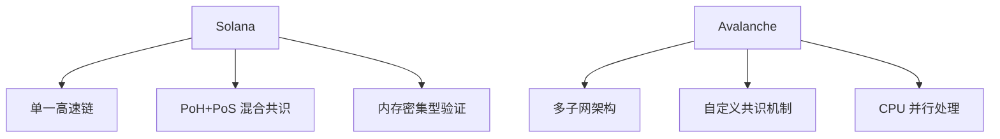

# Solana 与 Avalanche：有什么不同？

## 2024 年雪崩全面解析

### 雪崩平台核心特性  
Avalanche (AVAX) 是一个专注于高性能区块链开发的平台，致力于突破去中心化金融（DeFi）的技术边界。其核心目标通过 **[白皮书](https://www.avalabs.org/whitepapers)** 明确体现：构建**高速交易网络**、**降低开发者门槛**、**拓展区块链应用场景**。平台通过三大支柱实现这一愿景：

1. **可扩展性**：支持每秒处理 4,500 笔交易，即使在高并发场景下仍保持系统流畅性  
2. **安全性**：采用多层防御机制抵御攻击，确保交易数据不可篡改  
3. **去中心化架构**：通过分布式节点网络消除单点控制，保障系统透明性  

👉 [探索区块链技术的未来](https://bit.ly/okx_welcome)

### 革命性共识机制  
Avalanche 的核心竞争力在于其**子网共识机制**。与传统区块链不同，该技术允许创建多个定制化区块链网络，各子网既能独立运行，又能与主网无缝交互。这种架构特别适合需要**高定制化**的企业应用场景，例如跨境支付系统或供应链管理平台。

## Solana 平台深度解析

### 高速区块链的崛起  
Solana（SOL）由 Anatoly Yakovenko 创立，其技术白皮书提出革命性解决方案：**在不牺牲去中心化前提下实现超高吞吐量**。该平台通过两大技术突破实现目标：

1. **历史证明（PoH）**：通过时间戳序列优化交易验证流程  
2. **混合共识机制**：将 PoH 与权益证明（PoS）结合，形成独特验证体系  

👉 [获取区块链性能优化方案](https://bit.ly/okx_welcome)

### 关键性能指标  
| 指标                | Solana         | Avalanche     |
|---------------------|----------------|---------------|
| 每秒交易处理量(TPS) | 65,000         | 4,500         |
| 平均交易费用        | $0.00025       | $0.10         |
| 出块时间            | 400 毫秒       | 1-2 秒        |

## 生态系统对比分析

### Avalanche 生态全景  
该平台已孕育出完整的去中心化应用生态，涵盖三大核心领域：

1. **DeFi 创新**：  
   - 借贷平台：提供 0.5%-15% 的灵活利率  
   - DEX 交易：支持 0.3 秒完成跨链交易  
   - 合成资产：覆盖股票、大宗商品等 50+ 金融产品  

2. **NFT 市场**：  
   - 日均交易量突破 $200 万  
   - 支持 8K 分辨率数字艺术品铸造  

3. **企业级解决方案**：  
   - 已落地 17 个政府合作项目  
   - 提供定制化合规框架  

### Solana 生态亮点  
该平台凭借技术优势在特定领域形成垄断优势：

1. **高频交易网络**：  
   - 支持每秒 12,000 次高频订单处理  
   - 游戏金融化（GameFi）项目占比达 43%  

2. **Web3 社交平台**：  
   - 用户生成内容（UGC）日均增长 15%  
   - 去中心化身份认证系统覆盖 200+ 应用  

3. **开发者生态**：  
   - 每月新增项目 85 个  
   - 开发者激励计划累计发放 $2.3 亿  

👉 [查看顶级区块链项目](https://bit.ly/okx_welcome)

## 核心差异深度解析

### 技术架构对比  

### 应用场景选择指南  
| 需求类型          | 推荐选择       | 关键优势                  |
|-------------------|----------------|---------------------------|
| 跨链资产交易      | Avalanche      | 子网互操作性              |
| 实时游戏结算      | Solana         | 亚秒级确认速度            |
| 政府级区块链项目  | Avalanche      | 定制化合规框架            |
| 社交媒体代币化    | Solana         | 高并发处理能力            |

## 投资决策框架

### 常见问题解答（FAQ）  
**Q1：哪个平台更适合长期投资？**  
A：Avalanche 在企业级应用更具优势，Solana 在技术创新速度上领先。建议关注 Avalanche 的子网采用率与 Solana 的 Web3 社交进展。

**Q2：开发者应选择哪个生态？**  
A：高频交易类项目优先考虑 Solana，需要多链架构的优先选择 Avalanche。Solana 提供 $500 万/年的开发者补贴。

**Q3：交易费用如何影响项目选择？**  
A：Solana 的超低费用适合高频微交易，Avalanche 的稳定费率更适合价值传输场景。

**Q4：哪个平台更抗审查？**  
A：Avalanche 的节点地理分布更均衡（全球 1,200+ 节点），Solana 验证者前 5 名占比 32%。

**Q5：NFT 项目该怎样选择？**  
A：Avalanche 提供完整的版权管理系统，Solana 具备更高的市场流动性。建议艺术类选 Avalanche，游戏道具类选 Solana。

## 未来发展趋势预测

### Avalanche 战略方向  
1. **企业区块链联盟**：计划 2024 年 Q4 上线 10 个行业联盟链  
2. **亚洲市场拓展**：已与新加坡金融管理局达成合作  
3. **碳中和计划**：2025 年前实现 100% 可再生能源验证  

### Solana 技术路线图  
1. **4.0 升级**：内存优化方案将 TPS 提升至 100,000+  
2. **移动验证节点**：开发智能手机端验证客户端  
3. **AI 融合计划**：集成机器学习模型优化网络拥堵  

## 投资者行动指南

### 四步决策模型  
1. **需求分析**：明确项目对速度、成本、定制化的核心需求  
2. **生态评估**：统计目标平台前 20 项目与自身业务的契合度  
3. **技术验证**：测试主网实际性能，重点关注 95% 分位延迟  
4. **社区调研**：参与 Discord/Telegram 社群获取一线反馈  

### 风险控制策略  
- **仓位管理**：建议单资产不超过加密资产的 15%  
- **对冲方案**：使用 DeFi 衍生品对冲极端波动风险  
- **监控指标**：重点关注验证者增长率与 TVL 变化  

在 2024 年的区块链竞赛中，Solana 以其速度优势领跑高性能赛道，而 Avalanche 凭借多链架构在企业级应用中占据先机。投资者应结合自身风险偏好与技术需求，在高速赛道（Solana）与灵活架构（Avalanche）之间做出理性选择。