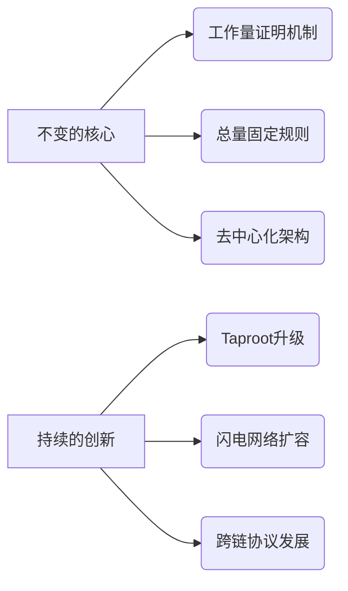

```markdown
# 比特币减半叙事上线，生态迎来新时代

## 比特币减半机制解析

比特币减半作为加密货币领域的标志性事件，其核心机制设计值得深入探讨。根据当前区块高度推算，下一次减半预计将在2024年4月28日发生，届时区块奖励将从6.25 BTC降至3.125 BTC。这一机制通过每四年区块奖励减半的设计，逐步将总量上限2100万枚的比特币释放周期延长至2140年。

👉 [探索比特币减半投资机会](https://bit.ly/okx_welcome)

在现行经济模型中，矿工收入由两部分构成：
1. **区块奖励**：当前为6.25 BTC/区块
2. **交易手续费**：随网络拥堵程度波动

历史数据显示，前三次减半后均出现价格波动周期：
| 减半时间 | 区块奖励变化 | 减半后12个月价格涨幅 |
|---------|-------------|--------------------|
| 2012年11月 | 50→25 BTC | +8894% |
| 2016年7月 | 25→12.5 BTC | +257% |
| 2020年5月 | 12.5→6.25 BTC | +298% |

## BitcoinFi创新浪潮

2023年比特币生态迎来转折点，Ordinals协议催生的BRC20标准正在重塑网络价值捕获机制。这一创新通过将同质化代币直接铭刻在比特币UTXO上，使得：
- 网络手续费收入创历史新高（2023年5月单日突破337万美元）
- 矿工收入结构发生显著变化（手续费占比从历史平均10%升至35%）
- 智能合约应用场景扩展（闪电网络、Taro协议等Layer2创新）

核心争议点在于：
- 技术路线分歧：是否违背中本聪"点对点电子现金"设计初衷
- 经济模型挑战：手续费激励能否长期维持网络安全
- 生态发展矛盾：区块空间资源争夺可能引发的网络拥堵

👉 [了解最新区块链技术动态](https://bit.ly/okx_welcome)

### FAQ环节

**Q：比特币减半会如何影响价格波动？**
A：历史数据显示减半后12-18个月常出现牛市周期，但需结合宏观经济、监管政策等多重因素综合判断。当前现货ETF审批、机构入场等新变量可能改变历史规律。

**Q：BRC20标准对矿工有何实质影响？**
A：短期带来手续费收入激增（2023年铭刻潮期间矿工日均收入增加$120万），长期可能构建手续费激励新范式。但需平衡网络可用性与矿工收益。

**Q：比特币生态创新是否威胁以太坊地位？**
A：当前DeFi市值占比仍以太坊占优（78% vs 比特币0.3%），但Taproot升级后比特币智能合约能力提升，可能在支付结算、资产托管等特定场景形成差异化竞争。

## 减半周期的变与不变

在比特币网络演进过程中，呈现出显著的二元性特征：


当前网络面临的关键转型：
1. **激励结构调整**：区块奖励占比将从当前90%降至未来不足10%
2. **安全成本转移**：网络安全维护从新发币补贴转向用户手续费支付
3. **生态价值重构**：从单一支付网络向多层价值互联网演进

值得关注的创新方向：
- **Layer2扩展**：包括闪电网络（处理速度达百万TPS）、Liquid Network（侧链结算）
- **资产协议**：Taro协议实现比特币网络上的多资产发行与转移
- **隐私增强**：Schnorr签名提升交易效率，Taproot改善智能合约隐私

👉 [获取区块链项目投资指南](https://bit.ly/okx_welcome)

## 未来展望与投资启示

随着减半时点临近，市场正形成三大共识：
1. **算力升级周期**：新一代矿机能效比提升（从110J/TH到30J/TH）
2. **生态爆发窗口**：BRC20代币市值突破10亿美元后，更多应用场景正在孵化
3. **合规化转型**：现货ETF申请、稳定币结算等合规路径取得进展

投资者需重点关注指标：
- 矿工持仓变化（反映市场预期）
- 网络手续费波动（生态活跃度晴雨表）
- Layer2项目进展（技术创新风向标）

这一历史性时刻正在见证比特币从"数字黄金"向"价值互联网"的范式转变，其生态创新的广度与深度将直接影响下一轮牛市的高度与形态。
```